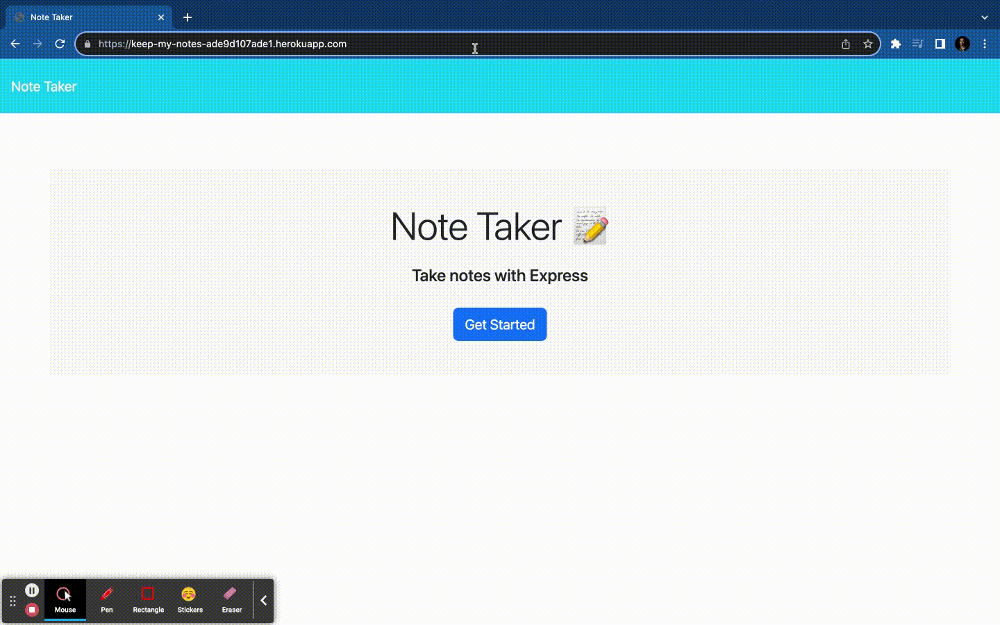
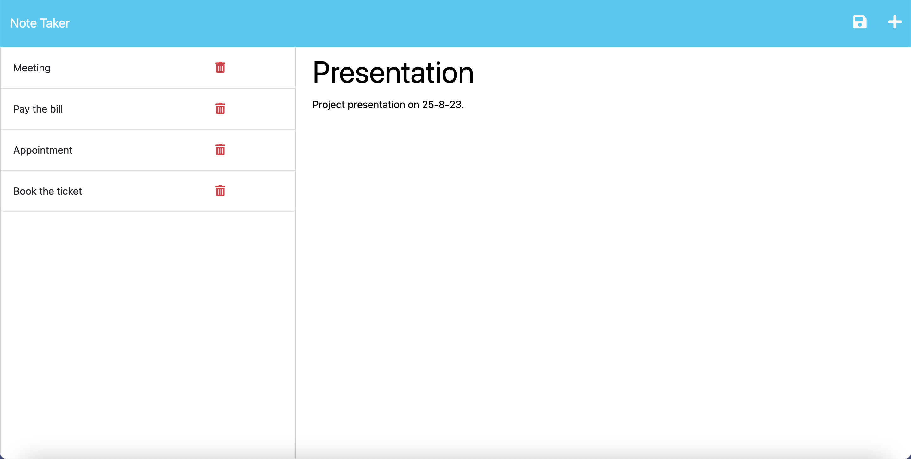
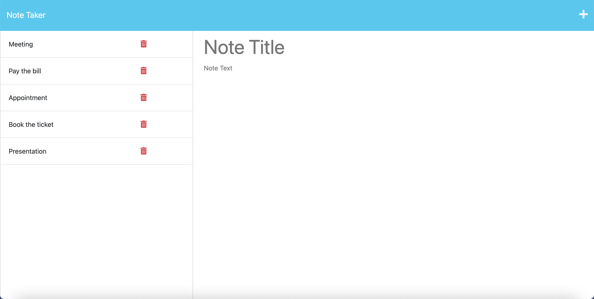
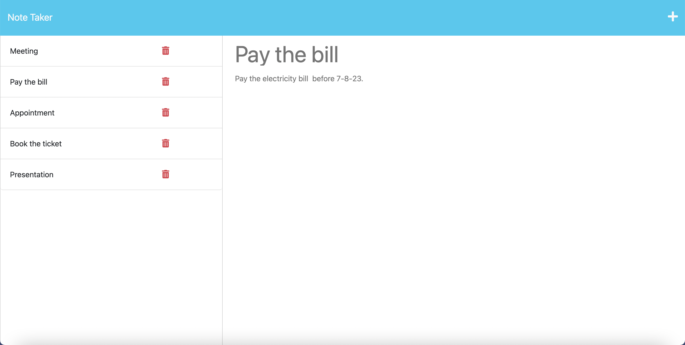
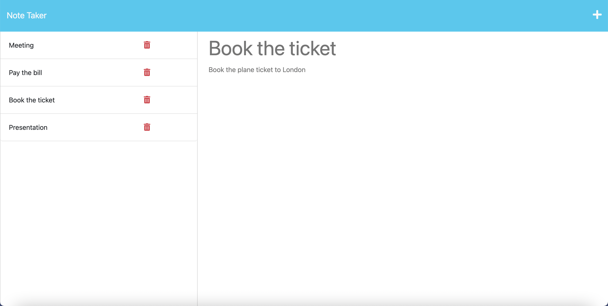

   
 # Note Taker

## Description


This application builds a webpage that enables the users to organize their thoughts and keep track of tasks they need to complete. The user can  write, save, view and delete notes. This application uses an Express.js back end and the data is saved and retrieved from a JSON file using the fs module. The HTML files are returned using the HTML routes and notes are saved, deleted and read using the API routes.

## Installation

- Install Node.js v16 
- Clone the Repository from GitHub
- Install  necessary dependencies running the following command :

  ```
  npm i 
  ```

## Usage

The user is presented with a landing page with a link to a notes page when the application is opened. When the notes page is opened ,then the already existing notes are displayed at the left hand column and empty fields to enter the title and text of the notes are shown at right hand column of the page. When the title and text are entered, then the save button will be visible on the top right side of the page. Once the note is saved , then the list of note titles displayed at the left side will be updated. Each of the saved note titles can be clicked to view the text of the note .The user can also delete a note by clicking on the delete button shown near the note title. The write button '+' on the top right can be clicked to write a new note which will display the empty fields to type the note title and text.

#### Link to deployed application :

https://keep-my-notes-ade9d107ade1.herokuapp.com/

The application can be invoked in the terminal by using the following command:

  ```
  node server.js  
  ```

OR

  ```
  npm start
  ```

The following images show the application's appearance and functionality :








## Credits

#### References

https://dev.to/gulshanaggarwal/npm-packages-to-generate-unique-ids-for-your-next-project-1p3b

https://devcenter.heroku.com/articles/getting-started-with-nodejs?singlepage=true#set-up
